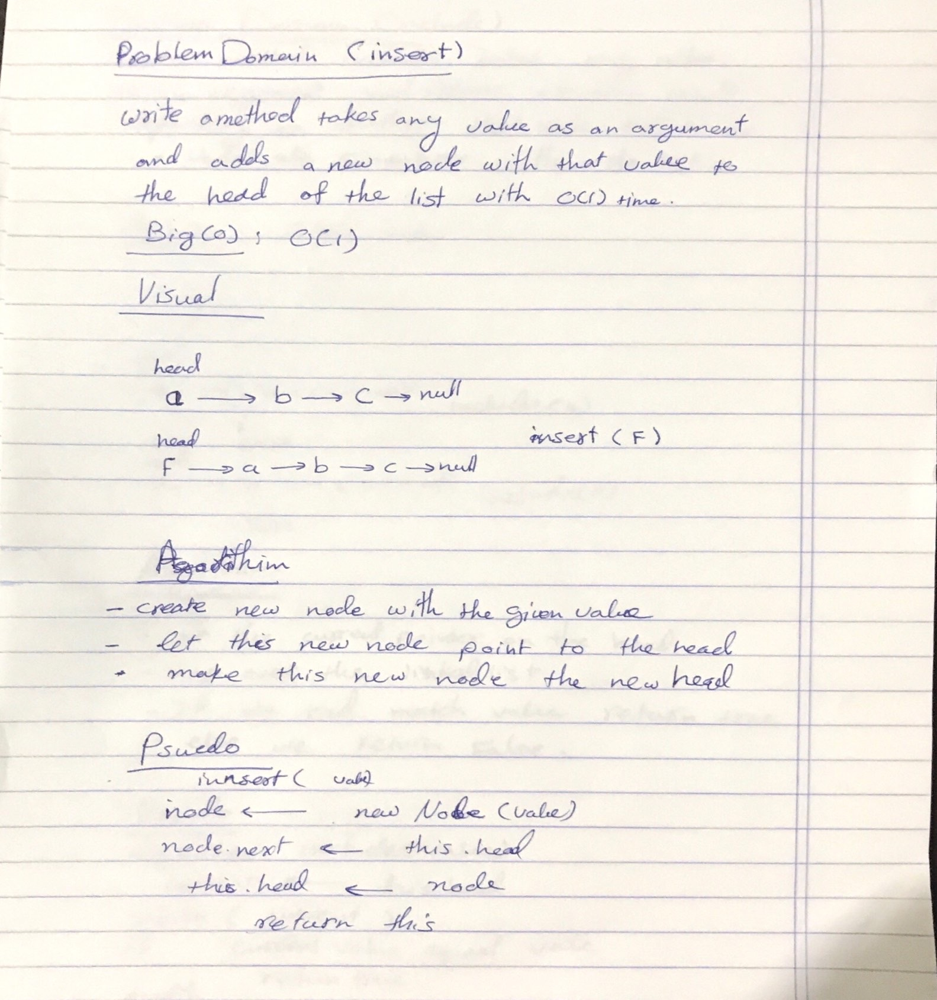
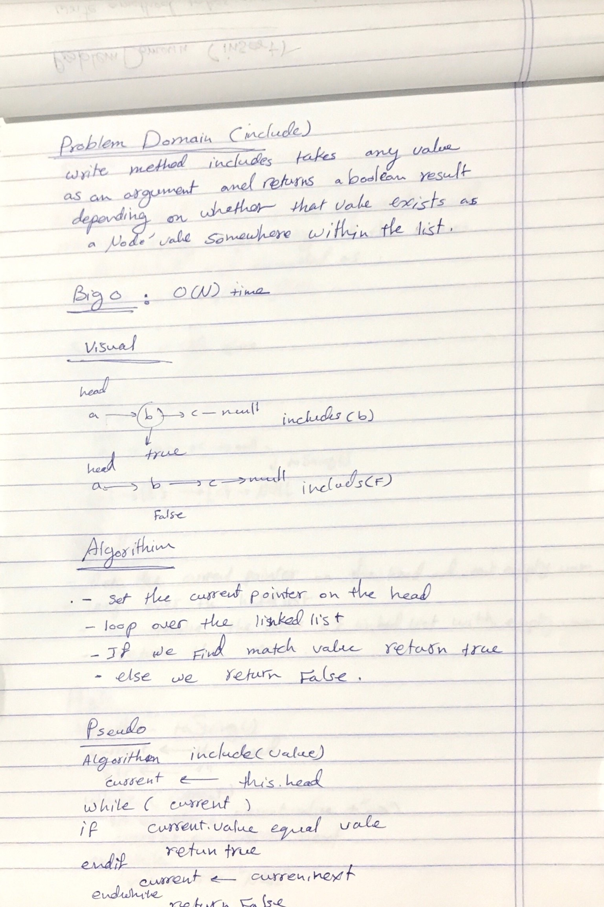
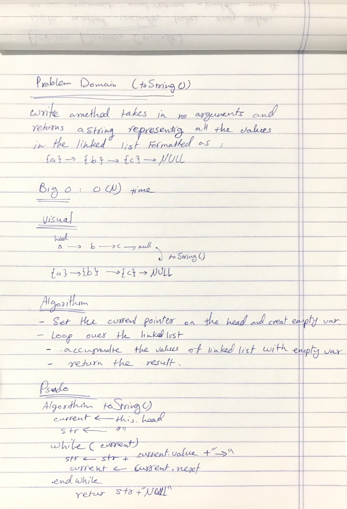
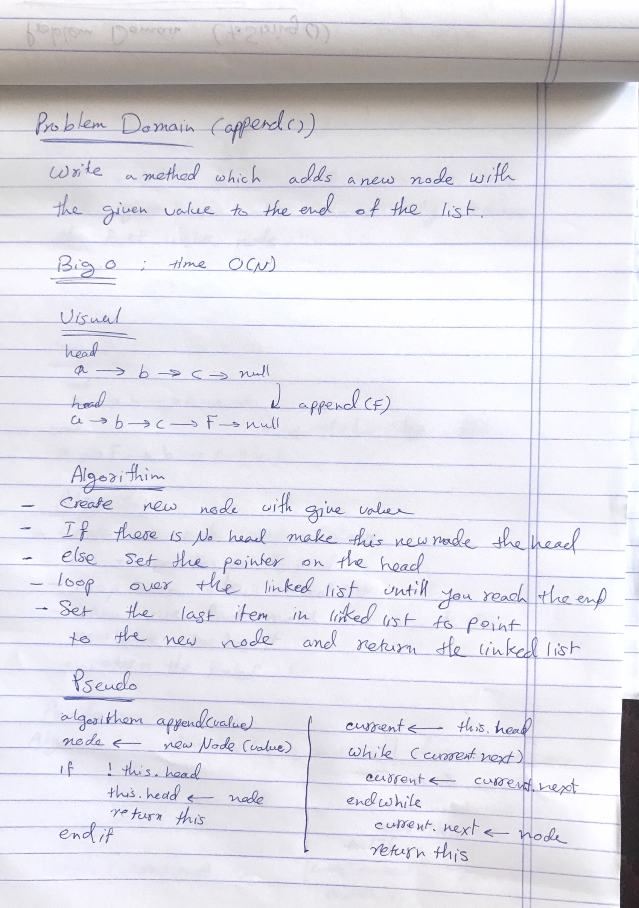
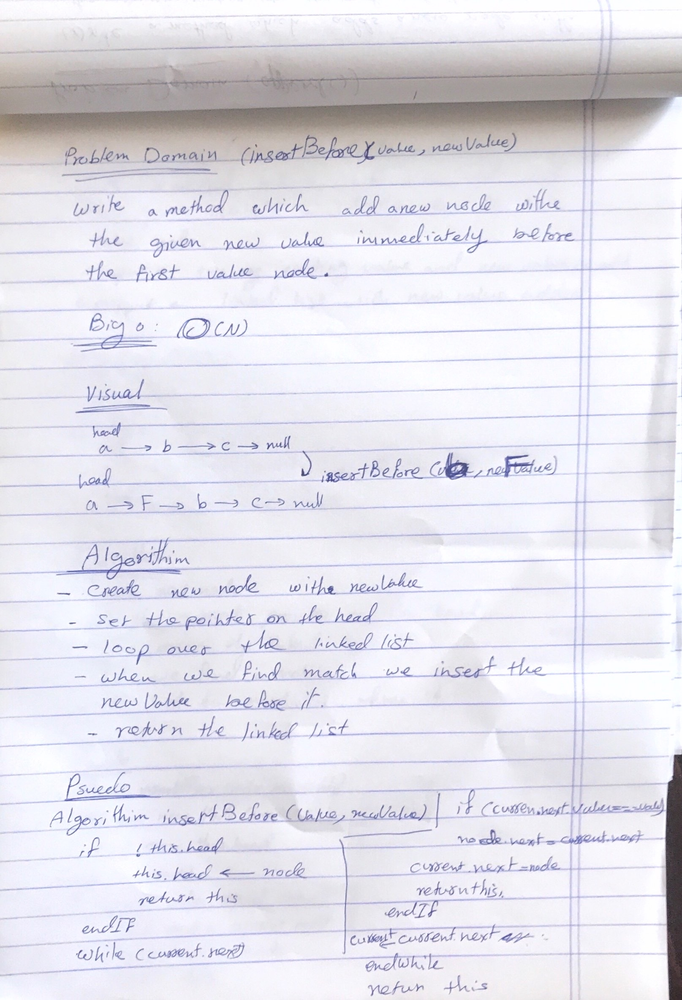
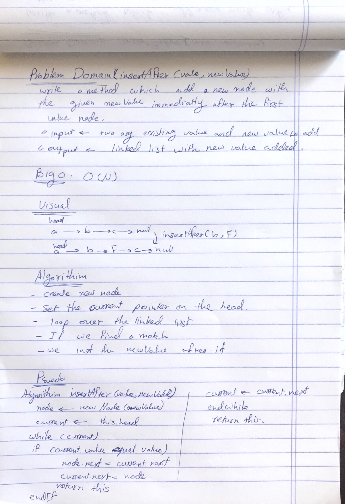

# Singly Linked List

A linked list is a linear data structure where each element is a separate object. Linked list elements are linked using pointers. Each node of a list is made up of two items - the data and a reference to the next node. The last node has a reference to null.

# class 05

## Challenge

Implement Singly Linked List in javascript and implement a way to insert, search and get linked list values.

## Approach & Efficiency

- Create a Node class that has properties for the value stored in the Node, and a pointer to the next Node.
- LinkedList class, include a head property. Upon instantiation, an empty Linked List should be created.
- a method called insert which takes any value as an argument and adds a new node with that value to the head of the list with an O(1) Time performance.
- a method called includes which takes any value as an argument and returns a boolean result depending on whether that value exists as a Node’s value somewhere within the list.
- a method called toString (or __str__ in Python) which takes in no arguments and returns a string representing all the values in the Linked List, formatted as:
"{ a } -> { b } -> { c } -> NULL"

### Bog O
- inser() -> time: O (1)
- include() -> time: O (N)
- toString() -> time: O (N)


## API

- Create a new linked list

```javascript
const newLinkedList = new LinkedList();
```

- Insert new value to your linked list

```javascript
newLinkedList.insert(value); \\return the linked list
```

- Search for specific value

```javascript
newLinkedList.include(value); \\return true if exist and false if not
```

- Get all linked list value as string

```javascript
newLinkedList.toString(); \\return your linked list value formated like "{ value } -> { value } -> { value } -> NULL"
```

## Solution







# class 06

## Challenge

Write the following methods for the Linked List class:
- .append(value) which adds a new node with the given value to the end of the list
- .insertBefore(value, newVal) which add a new node with the given newValue immediately before the first value node
- .insertAfter(value, newVal) which add a new node with the given newValue immediately after the first value node

## Approach & Efficiency

### Bog O
- time: O (N)

## API

- Create a new linked list

```javascript
const newLinkedList = new LinkedList();
```

- Add a new node with the given value to the end of the list

```javascript
newLinkedList.append(value); \\return the linked list
```

- Add a new node with the given newValue immediately before the first value node

```javascript
newLinkedList.insertBefore(value,newVal); \\return the linked list
```

- Add a new node with the given newValue immediately after the first value node

```javascript
newLinkedList.insertAfter(value, newVal); \\return the linked list
```


## Solution






