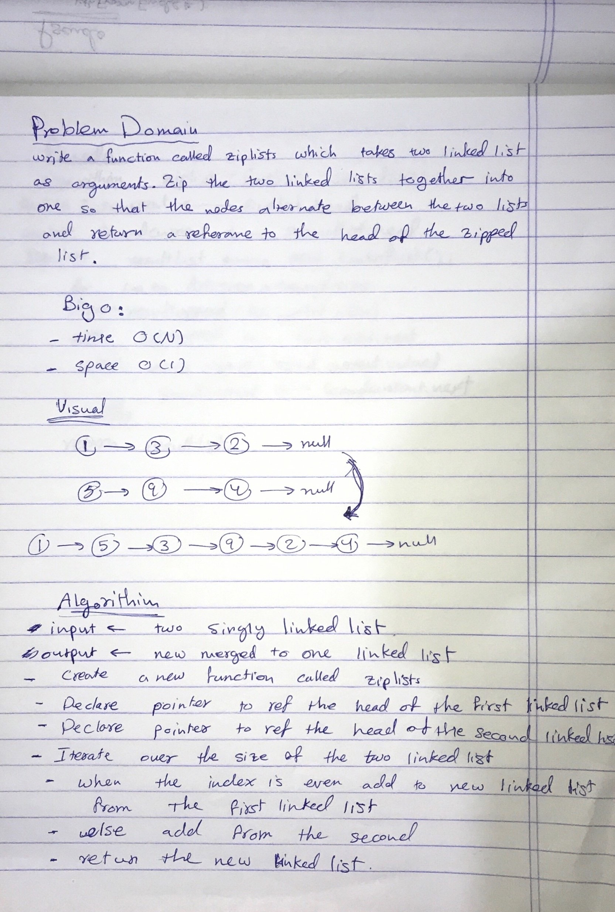
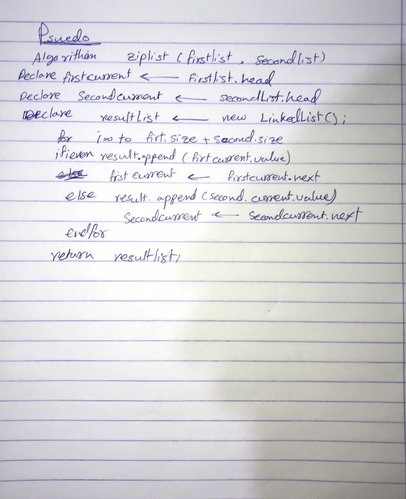

# Zip two linked lists.
Merge two given linked list in one alternativly.

## Challenge
Write a function called zipLists which takes two linked lists as arguments. Zip the two linked lists together into one so that the nodes alternate between the two lists and return a reference to the head of the zipped list. Try and keep additional space down to O(1). You have access to the Node class and all the properties on the Linked List class as well as the methods created in previous challenges.

## Approach & Efficiency
Basicly, We will use size proberty of the linked list. and we will iterate for the sum of the two input linked list and append base on the position to a new linked list.

- Big (O):
 1. space: O(1)
 2. time: O(N)

## Solution

- [link to code ](./ll-zip.js)

