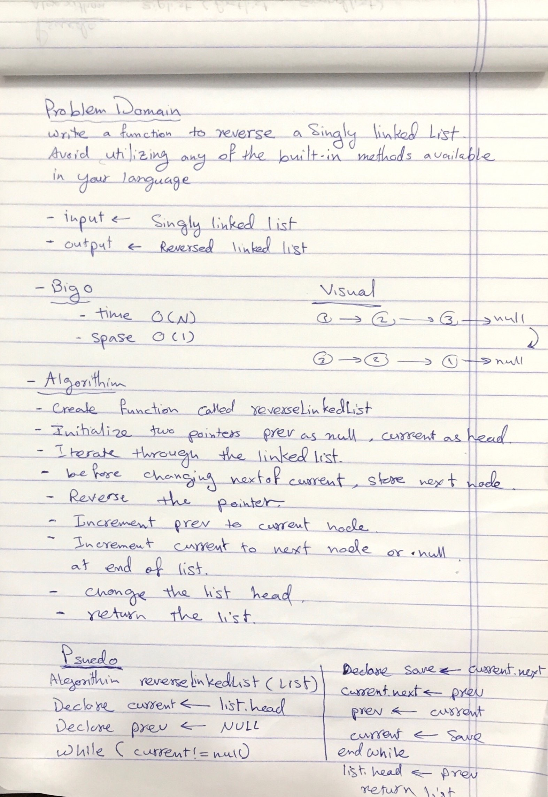

# Reverse a linked list
reverse a Singly Linked List.

## Challenge
- write a function to reverse a Singly Linked List.
- Avoid utilizing any of the built-in methods available in your language.

## Approach & Efficiency
- Iterating over the linked list and storing a reference to a current node, its previous node, and its next node.
   - In every iteration, after the next node is stored, the current’s node next pointer is pointed at the stored reference to the previous node.

- Big (O):
 1. space: O(1)
 2. time: O(N)

## Solution

- [link to code ](./reverse-linked-list.js)

