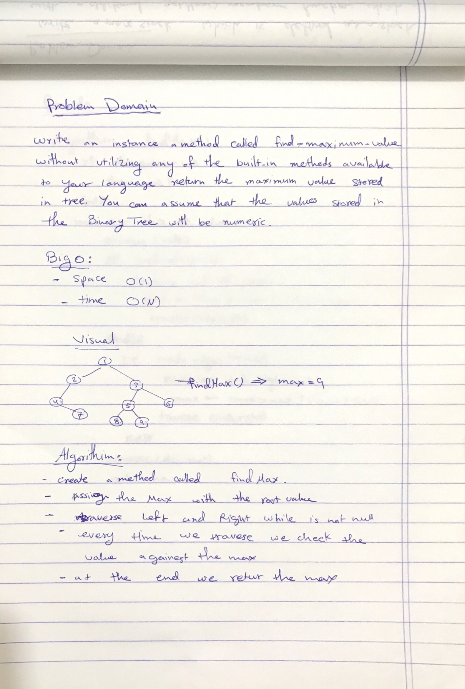
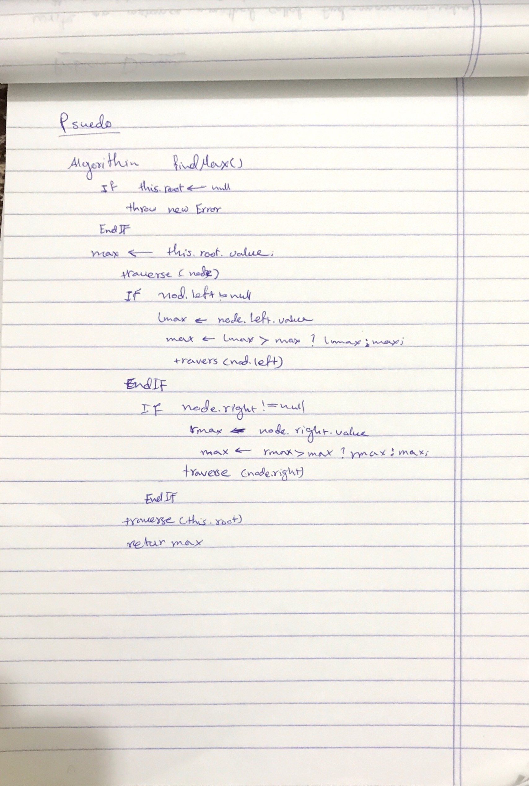

# Trees

tree is a collection of nodes connected by some edges. A tree is a non linear data structure. A Binary Search tree is a binary tree in which nodes that have lesser value are stored on the left while the nodes with a higher value are stored at the right.

## Challenge

Create tree class with adding metode and implement depth traverse methods.

## Approach & Efficiency

- Create a Node class that has properties for the value stored in the node, the left child node, and the right child node.
- Create a BinaryTree class
- Define a method for each of the depth first traversals called preOrder, inOrder, and postOrder which returns an array of the values, ordered appropriately.
- Any exceptions or errors that come from your code should be semantic, capturable errors. For example, rather than a default error thrown by your language, your code should raise/throw a custom, semantic error that describes what went wrong in calling the methods you wrote for this lab.

- Create a BinarySearchTree class
- Define a method named add that accepts a value, and adds a new node with that value in the correct location in the binary search tree.
- Define a method named contains that accepts a value, and returns a boolean indicating whether or not the value is in the tree at least once.

### Bog O

- add() -> time: O(h)
- preOrder() -> time: O(n)
- inOrder() -> time: O(n)
- postOrder() -> time: O(n)
- search() -> time O(h)

## API


- Create a new binary search tree

```javascript
var Bst = new BinaryTree();
```

- Insert new value to your tree

```javascript
Bst.add(value);
```

- Search for specific value

```javascript
Bst.contains(value);
```

- Create a new binary tree

```javascript
var Bt = new BinaryTree();
```

- Performs preorder traversal of a tree 

```javascript
Bt.preOrder();
```

- Performs inorder traversal of a tree 

```javascript
Bt.inOrder();
```

- Performs postorder traversal of a tree 

```javascript
Bt.postOrder();
```

- find the maximum number in a binary tree 

```javascript
Bt.findMax();
```

# Class 16 : Find the Maximum Value in a Binary Tree

## Challenge

Create a method that return a maximum number in a given value.


## Approach & Efficiency

- Create a methode called findMax.
- assign max variable with root value.
- traverse left and right while not null.
- every time we traverse we check the value againest the max
- at the end return the max.

- big o: 
1. space o(1)
2. time o(n)


## whiteboard





