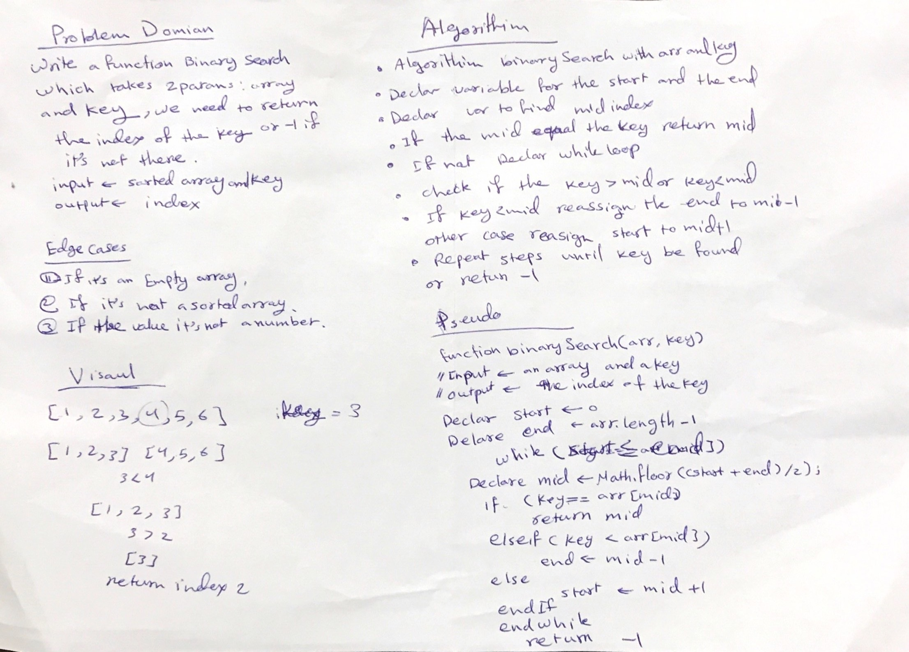

# Array Binary Search
Find in sorted array val and return the index of this val;

## Challenge
Write a function called BinarySearch which takes in 2 parameters: a sorted array and the search key. Without utilizing any of the built-in methods available to your language, return the index of the array’s element that is equal to the search key, or -1 if the element does not exist.

## Approach & Efficiency
Iterative approach, we will use a while loop and the loop will run until it hits the base condition i.e start becomes greater than end.

- Big (O):
 1. space: O(1)
 2. time: O(log N)

## Solution

- [link to code ](./array-binary-search.js)

