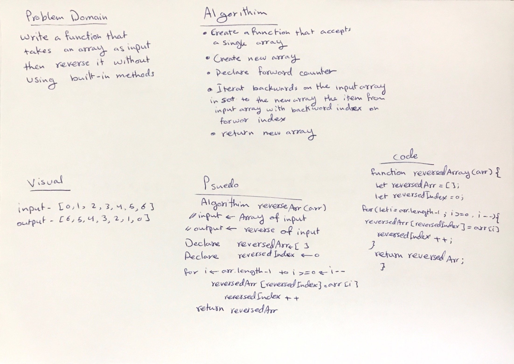

# Reverse an Array
A function that takes an array of items and outputs a new array with the items from the initial array reversed.

## Challenge
Write a function called reverseArray which takes an array as an argument. Without utilizing any of the built-in methods available to your language, return an array with elements in reversed order.

## Approach & Efficiency
Since we were not allowed to use built-in array methods for this challenge, We can loop through the input array and "push" its values into the new array without using the actual push method.So we have to use an incrementing counter that would allow us to start the index of the new array at zero and then for each iteration through the input array (going backwards via "i--"), we would set the value of the new array's incrementing index to the current index value of the input array.

## Solution

