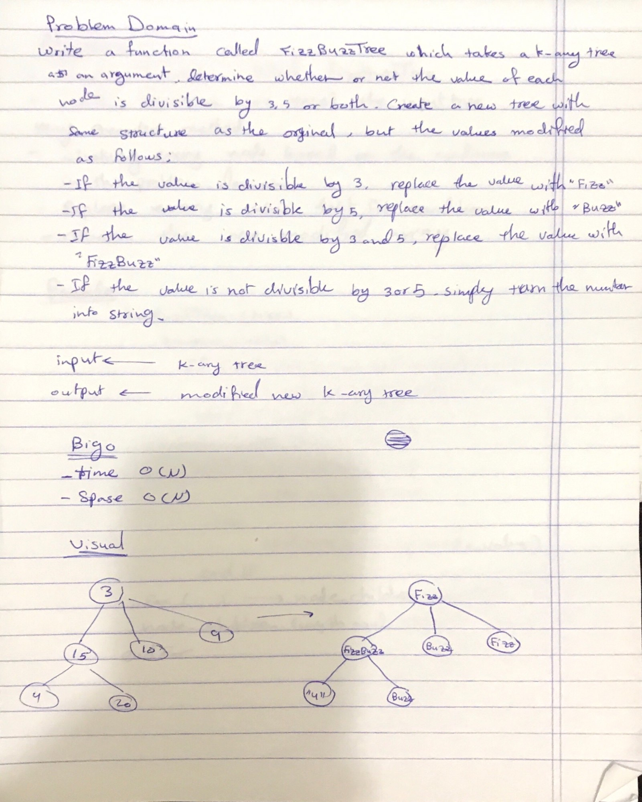
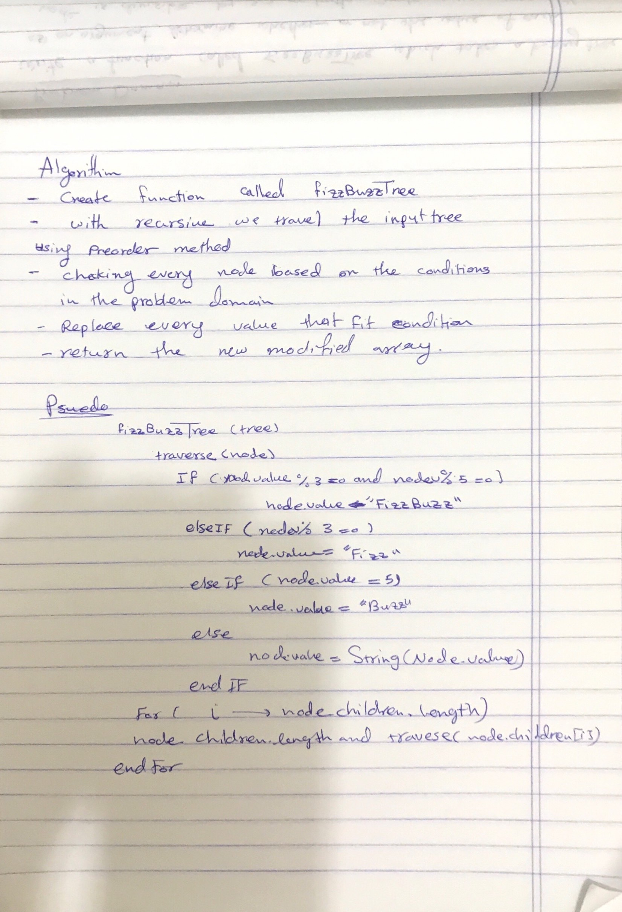

# FizzBuzz

A function that takes a tree and it check it for some conditions and replace it values with other values and return new tree.

## Challenge
Write a function called FizzBuzzTree which takes a k-ary tree as an argument.
Without utilizing any of the built-in methods available to your language, determine whether or not the value of each node is divisible by 3, 5 or both. Create a new tree with the same structure as the original, but the values modified as follows:
If the value is divisible by 3, replace the value with “Fizz”
If the value is divisible by 5, replace the value with “Buzz”
If the value is divisible by 3 and 5, replace the value with “FizzBuzz”
If the value is not divisible by 3 or 5, simply turn the number into a String.

## Approach & Efficiency
- big o:
  1. time o(n)
  2. space o(n)

## Solution

- [link to code ](./fizz-buzz-tree.js)

