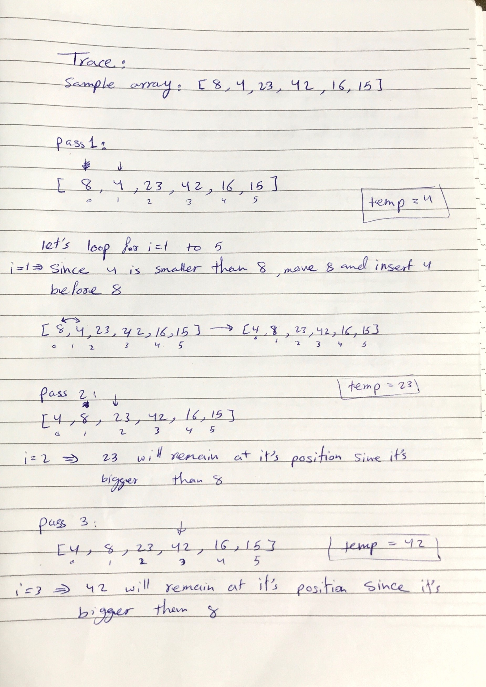
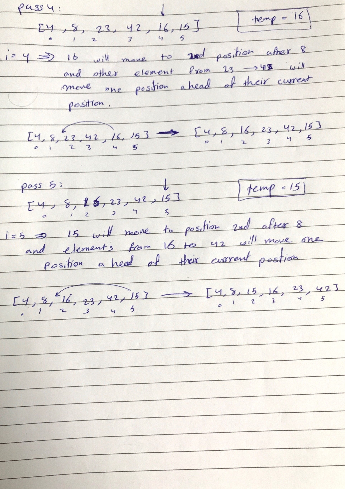

# Challenge Summary
Insertion sort is a simple sorting algorithm that works similar to the way you sort playing cards in your hands. The array is virtually split into a sorted and an unsorted part. Values from the unsorted part are picked and placed at the correct position in the sorted part.

## Challenge Description
write a function that take an array and sort it using the insertion sort algorithm 

## Approach & Efficiency
To sort an array of size n in ascending order:
1. Iterate from arr[1] to arr[n] over the array.
2. Compare the current element (key) to its predecessor.
3. If the key element is smaller than its predecessor, compare it to the elements before. Move the greater elements one position up to make space for the swapped element.

big o:
- Time : O(n*2)
-  Space: O(1)

## Solution

