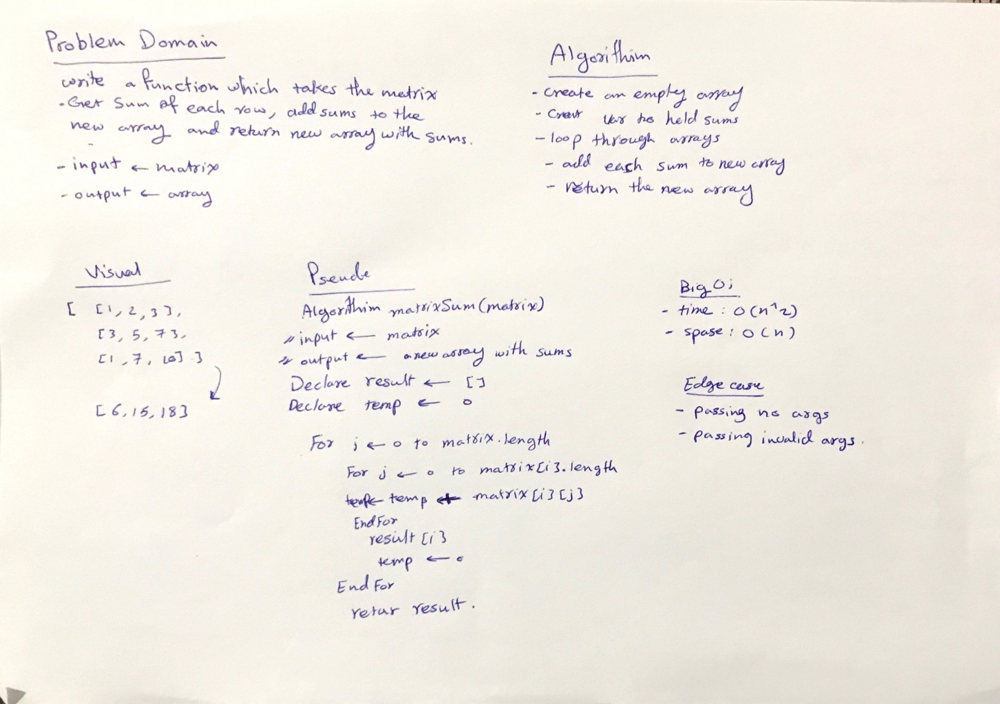

# Matrix 
sum the entires of each row in the matrix and store it as an element in new array.

## Challenge
write a function to add up the sum of each row in a matrix of arbitrary size, and return an array with the appropriate values.

## Approach & Efficiency
looping throught the matrix twic. In first time the loop will cover all the rows and in the second loop will cover all the columns. and in the second loop we summ all the columns value and store it as element in new array.

- Big (O):
 1. space: O(n)
 2. time: O(n^2)

## Solution

- [link to code ](./matrix-sum.js)

