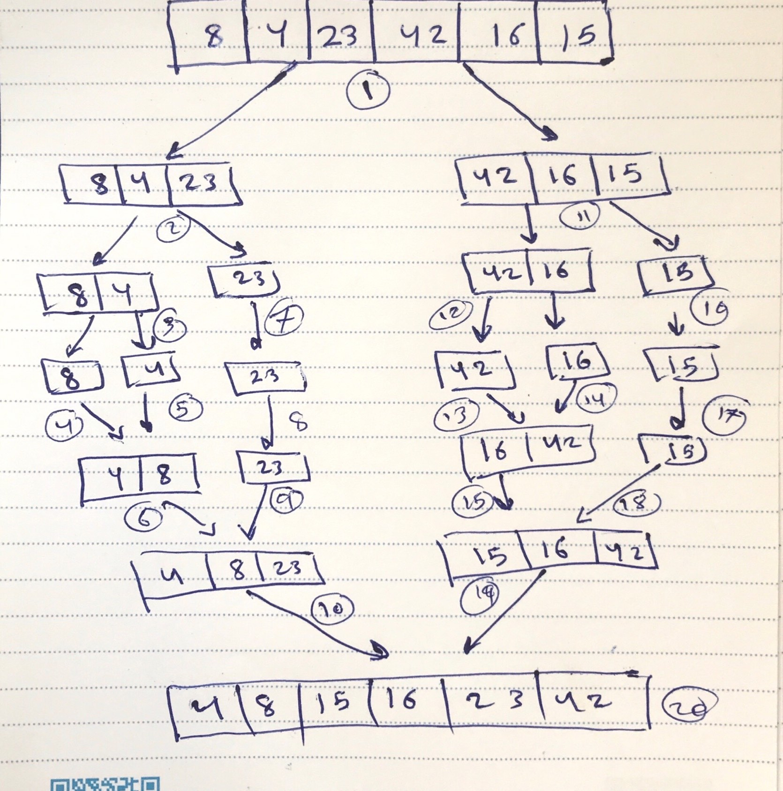

# Challenge Summary
Merge sort is one of the most popular sorting algorithms today and it uses the concept of divide and conquer to sort a list of elements. Meaning, it will divide the bigger problem into smaller problems and then solve each of the small problems in order to solve the bigger problem that we started out with.

## Challenge Description
write a function that take an array and sort it using the merge sort algorithm 

## Approach & Efficiency
To sort an array of size n in ascending order:
1. if it is only one element in the list it is already sorted, return.
2. divide the list recursively into two halves until it can no more be divided.
3. merge the smaller lists into new list in sorted order.

big o:
- Time : O(nLogn))
-  Space: O(n)

## Solution

