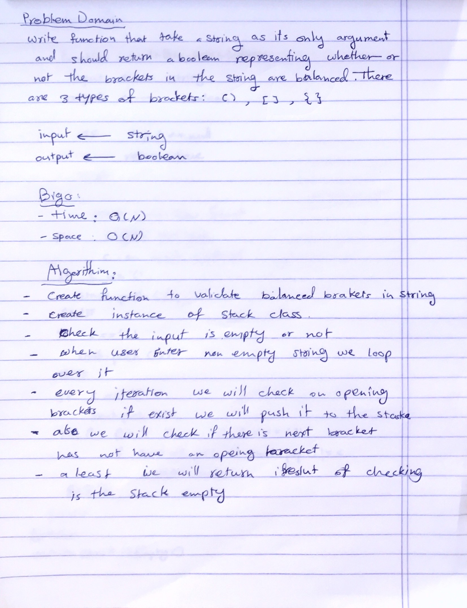

# Multi-bracket Validation.

Validate if the input string have a balanced brackets.

## Challenge
Your function should take a string as its only argument, and should return a boolean representing whether or not the brackets in the string are balanced. There are 3 types of brackets:

- Round Brackets : ()
- Square Brackets : []
- Curly Brackets : {}

## Approach & Efficiency
Using Stack:

- Initialize a Stack.
- Iterate the input string, one character at a time.
- Check if character is open bracket
- ‘(‘, if yes then push closed bracket ‘)’ to stack.
- ‘[‘, if yes then push closed bracket ‘]’ to stack.
- ‘{‘, if yes then push closed bracket ‘}’ to stack
- Else check if character is close bracket, either ‘)‘ or ‘]’ or ‘}’  if yes then
- Check if stack is empty, if yes return false.
- Else if stack is not empty, pop from stack and popped bracket should be same as current bracket else return false.
- If at the end stack is empty, return true else return false.

- Big (O):
 1. space: O(n)
 2. time: O(n)

## Solution

- [link to code ](./multi-bracket-validation.js)

